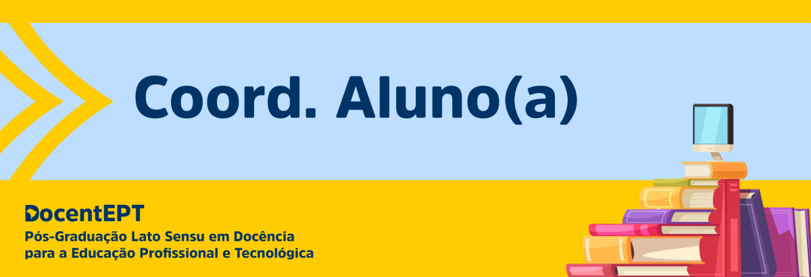
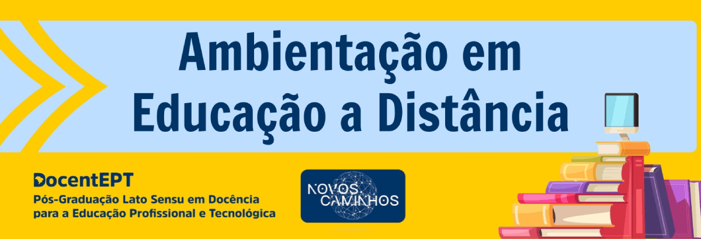

# DocentEPT

Pós-Graduação Lato Sensu em Docência para Educação Profissional e Tecnológica - IFES Colatina.

<!-- TOC -->

- [DocentEPT](#docentept)
    - [Coordenação Aluno 2022](#coordena%C3%A7%C3%A3o-aluno-2022)
        - [Documentação](#documenta%C3%A7%C3%A3o)
        - [Requerimento](#requerimento)
        - [Grade Curricular](#grade-curricular)
    - [Disciplinas](#disciplinas)
        - [Ambientação em Educação a Distância](#ambienta%C3%A7%C3%A3o-em-educa%C3%A7%C3%A3o-a-dist%C3%A2ncia)
            - [Referências](#refer%C3%AAncias)
            - [Atividade](#atividade)

<!-- /TOC -->

---

## Coordenação Aluno 2022

Aula Inaugural do Curso de Especialização Lato Sensu em Docência para Educação Profissional

### Documentação

      

### Requerimento 

Para fazer sua solicitação, você deverá:

- Preencher e assinar o Formulário para Requerimentos;
- Digitalizar e enviar juntamente com o documento solicitado no formulário;
- Enviar para o e-mail: docentept@ifes.edu.br

### Grade Curricular

|                        **Disciplinas**                        | **Carga Horária** |                      **Docentes**                      |
|:-------------------------------------------------------------:|:-----------------:|:------------------------------------------------------:|
|                            EAD/AVA                            |         20        | Mariella Berger e Yvina Pavan Baldo                    |
|                      Epistemologia da EPT                     |         60        | Gustavo Moraes, Larissy Cotonhoto e Olivier Allain     |
| Educação de Jovens e Adultos e Teorias da Aprendizagem na EPT |         60        | Jaqueline Maissiat, Sanandreia Perini e Olivier Allain |
|                Tecnologias Educacionais na EPT                |         60        | Igor MEndonça e Yvina Pavan Baldo                      |
|                            Didática                           |         60        | Paulo Wollinger e Indiana Reis                         |
|                   Prática Inclusivas na EPT                   |         40        | Larissy Cotonhoto e Emilene Coco                       |
|                      Projetos Pedagógicos                     |         60        | Elizabete Sandrini e Sananadreia Perini                |
|                Pesquisa e Extensão Tecnológicas               |         40        | Emilene Coco e Indiana Reis                            |
|                             Libras                            |         30        | Eliana Burgarelli e Carla Rejane                       |
|                    Trabalho Final de Curso                    |         30        | Paulo Wollinger e Jaqueline Maissiat                   |

---

## Disciplinas

### Ambientação em Educação a Distância

Professor Mediador: [Manoel Augusto Polastreli Barbosa](https://ava.cefor.ifes.edu.br/user/view.php?id=16311&course=27101)

Professores Formadores: 

- [Mariella Berger Andrade](https://ava.cefor.ifes.edu.br/user/view.php?id=75&course=27101)
- [Yvina Pavan Baldo](https://ava.cefor.ifes.edu.br/user/view.php?id=10&course=27101)

[Infográfico de Apresentação da Disciplina desenvolvido na ferramenta Genially.](https://view.genial.ly/62558271050f22001205fbcb/interactive-content-ead-ava-20221-docentep)

---

#### Videoaulas

Ambientes virtuais de aprendizagem

Educação a distancia: mitos e verdades

---

#### Referências

[O que é o Moodle?](https://crescercomeducacao.com.br/o-que-e-o-moodle/) 

[Net Etiqueta na EAD](https://crescercomeducacao.com.br/netiqueta-na-ead/) 

[Diretrizes Curriculares Nacionais Gerais para a Educação Profissional e Tecnológica](https://www.in.gov.br/web/dou/-/resolucao-cne/cp-n-1-de-5-de-janeiro-de-2021-297767578)

[Diretrizes para educação a distância da Rede Federal de Educação Profissional e Tecnológica: módulo histórico](http://proedu.rnp.br/handle/123456789/1653)

[Diretrizes para educação a distância da Rede Federal de Educação Profissional e Tecnológica: módulo de legislação](http://proedu.rnp.br/handle/123456789/1655)

[Diretrizes para Educação a Distância da Rede Federal de Educação Profissional e Tecnológica: módulo estrutural](http://proedu.rnp.br/handle/123456789/1654)

A Educação a Distância e as tendências do segmento

[Educação a Distância: breve histórico e contribuições da Universidade Aberta do Brasil (UAB) e Rede E-Tec Brasil](https://www.researchgate.net/publication/324136558_EDUCACAO_A_DISTANCIA_NO_BRASIL_breve_historico_e_contribuicoes_da_Universidade_Aberta_do_Brasil_e_Rede_e-Tec_Brasil)

---

#### Atividades

https://padlet.com/

Paines dos grupos:
- Grupo 1: Afetividade na EaD
- Grupo 2: A importância do Feedback na EaD
- Grupo 3: O papel do tutor/mediador na EaD
- Grupo 4: Colaboração na EaD 
- [Grupo 5: Avaliação na EaD](https://crescercomeducacao.com.br/avaliacao-no-ead/) 
- Grupo 6: O Fórum na EaD
- Grupo 7: Design Educacional para EaD
- Grupo 8: Google Sala de Aula

Colaborar nos painéis desenvolvidos pelos grupos siga as instruções a seguir:

- [] Acesse os links do Padlets (quadros esquemáticos/painéis colaborativos) construídos, disponíveis no fórum da semana 2. 
- [] Você deverá visitar e comentar em ao menos um dos quadros esquemáticos/painéis colaborativos desenvolvidos pelos grupos.
- [] Os comentários devem incluir: uma análise geral da estrutura do trabalho (textos, mídias, forma de dispor as informações); observações sobre as relações entre os trabalhos do grupo analisado e o de quem comenta. 

---

### Epistemologia da EPT 

Professor Mediador: 

Professores Formadoradores: 

- Gustavo Moraes
- Larissy Cotonhoto
- Olivier Allain

---

#### Videoaulas

Epistemologia da EPT

Educação de Jovens e Adultos e Teorias da Aprendizagem na EPT

Didática Profissional

---

#### Referências

---

#### Atividades