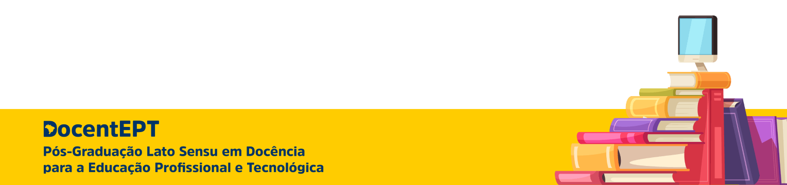
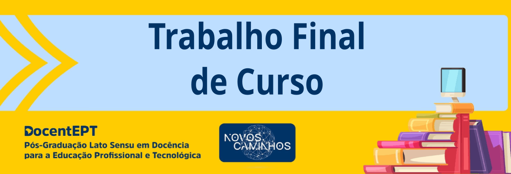

# DocentEPT

Pós-Graduação Lato Sensu em Docência para Educação Profissional e Tecnológica - IFES Colatina.

<!-- TOC -->

- [DocentEPT](#docentept)
    - [Coordenação Aluno 2022](#coordena%C3%A7%C3%A3o-aluno-2022)
        - [Documentação](#documenta%C3%A7%C3%A3o)
        - [Requerimento](#requerimento)
        - [Grade Curricular](#grade-curricular)
    - [Disciplinas](#disciplinas)
        - [Ambientação em Educação a Distância](#ambienta%C3%A7%C3%A3o-em-educa%C3%A7%C3%A3o-a-dist%C3%A2ncia)
            - [Videoaulas](#videoaulas)
            - [Referências](#refer%C3%AAncias)
            - [Atividades](#atividades)
        - [Epistemologia da EPT](#epistemologia-da-ept)
            - [Cronograma](#cronograma)
            - [Videoaulas](#videoaulas)
            - [Referências](#refer%C3%AAncias)
                - [Básicas](#b%C3%A1sicas)
                - [Complementares](#complementares)
            - [Atividades](#atividades)
                - [Semana 01](#semana-01)
                    - [Leituras Complementares](#leituras-complementares)
        - [Educação de Jovens e Adultos e Teorias da Aprendizagem na EPT](#educa%C3%A7%C3%A3o-de-jovens-e-adultos-e-teorias-da-aprendizagem-na-ept)
            - [Cronograma](#cronograma)
            - [Videoaulas](#videoaulas)
            - [Referências](#refer%C3%AAncias)
                - [Básica](#b%C3%A1sica)
                - [Complementar](#complementar)
            - [Atividades](#atividades)
        - [Tecnologias Educacionais na EPT](#tecnologias-educacionais-na-ept)
            - [Videoaulas](#videoaulas)
            - [Referências](#refer%C3%AAncias)
            - [Atividades](#atividades)
        - [Didática](#did%C3%A1tica)
            - [Videoaulas](#videoaulas)
            - [Referências](#refer%C3%AAncias)
            - [Atividades](#atividades)
        - [Práticas Inclusivas na EPT](#pr%C3%A1ticas-inclusivas-na-ept)
            - [Videoaulas](#videoaulas)
            - [Referências](#refer%C3%AAncias)
            - [Atividades](#atividades)
        - [Projetos Pedagógicos](#projetos-pedag%C3%B3gicos)
            - [Videoaulas](#videoaulas)
            - [Referências](#refer%C3%AAncias)
            - [Atividades](#atividades)
        - [Pesquisa e Extensão Tecnológicas](#pesquisa-e-extens%C3%A3o-tecnol%C3%B3gicas)
            - [Videoaulas](#videoaulas)
            - [Referências](#refer%C3%AAncias)
            - [Atividades](#atividades)
        - [Libras](#libras)
            - [Videoaulas](#videoaulas)
            - [Referências](#refer%C3%AAncias)
            - [Atividades](#atividades)
        - [Trabalho Final de Curso](#trabalho-final-de-curso)

<!-- /TOC -->

---

## Coordenação Aluno 2022

Aula Inaugural do Curso de Especialização Lato Sensu em Docência para Educação Profissional

### Documentação

      

### Requerimento 

Para fazer sua solicitação, você deverá:

- Preencher e assinar o Formulário para Requerimentos;
- Digitalizar e enviar juntamente com o documento solicitado no formulário;
- Enviar para o e-mail: docentept@ifes.edu.br

### Grade Curricular

|                        **Disciplinas**                        | **Carga Horária** |                      **Docentes**                      |
|:-------------------------------------------------------------:|:-----------------:|:------------------------------------------------------:|
|                            EAD/AVA                            |         20        | Mariella Berger e Yvina Pavan Baldo                    |
|                      Epistemologia da EPT                     |         60        | Gustavo Moraes, Larissy Cotonhoto e Olivier Allain     |
| Educação de Jovens e Adultos e Teorias da Aprendizagem na EPT |         60        | Jaqueline Maissiat, Sanandreia Perini e Olivier Allain |
|                Tecnologias Educacionais na EPT                |         60        | Igor MEndonça e Yvina Pavan Baldo                      |
|                            Didática                           |         60        | Paulo Wollinger e Indiana Reis                         |
|                   Práticas Inclusivas na EPT                   |         40        | Larissy Cotonhoto e Emilene Coco                       |
|                      Projetos Pedagógicos                     |         60        | Elizabete Sandrini e Sananadreia Perini                |
|                Pesquisa e Extensão Tecnológicas               |         40        | Emilene Coco e Indiana Reis                            |
|                             Libras                            |         30        | Eliana Burgarelli e Carla Rejane                       |
|                    Trabalho Final de Curso                    |         30        | Paulo Wollinger e Jaqueline Maissiat                   |

---

## Disciplinas

### Ambientação em Educação a Distância

Professor Mediador: [Manoel Augusto Polastreli Barbosa](https://ava.cefor.ifes.edu.br/user/view.php?id=16311&course=27101)

Professores Formadores: 

- [Mariella Berger Andrade](https://ava.cefor.ifes.edu.br/user/view.php?id=75&course=27101)
- [Yvina Pavan Baldo](https://ava.cefor.ifes.edu.br/user/view.php?id=10&course=27101)

[Infográfico de Apresentação da Disciplina desenvolvido na ferramenta Genially.](https://view.genial.ly/62558271050f22001205fbcb/interactive-content-ead-ava-20221-docentep)

---

#### Videoaulas

Ambientes virtuais de aprendizagem

Educação a distancia: mitos e verdades

---

#### Referências

[O que é o Moodle?](https://crescercomeducacao.com.br/o-que-e-o-moodle/) 

[Net Etiqueta na EAD](https://crescercomeducacao.com.br/netiqueta-na-ead/) 

[Diretrizes Curriculares Nacionais Gerais para a Educação Profissional e Tecnológica](https://www.in.gov.br/web/dou/-/resolucao-cne/cp-n-1-de-5-de-janeiro-de-2021-297767578)

[Diretrizes para educação a distância da Rede Federal de Educação Profissional e Tecnológica: módulo histórico](http://proedu.rnp.br/handle/123456789/1653)

[Diretrizes para educação a distância da Rede Federal de Educação Profissional e Tecnológica: módulo de legislação](http://proedu.rnp.br/handle/123456789/1655)

[Diretrizes para Educação a Distância da Rede Federal de Educação Profissional e Tecnológica: módulo estrutural](http://proedu.rnp.br/handle/123456789/1654)

A Educação a Distância e as tendências do segmento

[Educação a Distância: breve histórico e contribuições da Universidade Aberta do Brasil (UAB) e Rede E-Tec Brasil](https://www.researchgate.net/publication/324136558_EDUCACAO_A_DISTANCIA_NO_BRASIL_breve_historico_e_contribuicoes_da_Universidade_Aberta_do_Brasil_e_Rede_e-Tec_Brasil)

---

#### Atividades

https://padlet.com/

Paines dos grupos:
- Grupo 1: Afetividade na EaD
- Grupo 2: A importância do Feedback na EaD
- Grupo 3: O papel do tutor/mediador na EaD
- Grupo 4: Colaboração na EaD 
- [Grupo 5: Avaliação na EaD](https://crescercomeducacao.com.br/avaliacao-no-ead/) 
- [Grupo 6: O Fórum na EaD](https://crescercomeducacao.com.br/forum-na-ead/)
- [Grupo 7: Design Educacional para EaD](https://crescercomeducacao.com.br/design-educacional/)
- [Grupo 8: Google Sala de Aula](https://www.canva.com/design/DAFClSJovLU/3Wxn0LLZN4IdEvn8o6AMvA/view?utm_content=DAFClSJovLU&utm_campaign=designshare&utm_medium=link&utm_source=publishpresent)

---

### Epistemologia da EPT 

Professor Mediador: 

Professores Formadoradores: 

- Gustavo Moraes
- [Larissy Cotonhoto](https://ava.cefor.ifes.edu.br/user/view.php?id=8300&course=27459)
- Olivier Allain

**Carga horária**: 60h
 
**Ementa**

Esta unidade curricular está dividida em três momentos: conceitual, histórico e estrutural.

- **Fundamentos epistemológicos da EP**: Conceitos de técnica, tecnologia, trabalho e EP; Trabalho como exercício social da técnica. EP como um direito do trabalhador; Dimensões humanas do trabalho: identitária, estética, ética, cultural, social, econômica; O trabalho como obra; O saber do/no trabalho e sua aprendizagem; Conceitos de ergonomia, psicologia e análise do trabalho; Interdisciplinaridade ampla.
- **História da Educação Profissional**: Trabalho e técnica no Brasil colônia; A EP no século XIX; República: Educação e formação para o trabalho; Educação Profissional no século XX.
- **Estrutura e Políticas da Educação Profissional**: Ofertantes de EP: rede federal, serviços nacionais de aprendizagem, redes estaduais e privadas; Políticas e legislação de Educação Profissional; Eixos Tecnológicos, Catálogos e Novo Ensino Médio; Itinerários Formativos; Políticas Públicas para a Educação Profissional.

**Objetivos**

- Permitir uma compreensão dos fundamentos da Educação Profissional;
- Permitir compreensão das diversas dimensões do trabalho, da formação profissional, da interprofissionalidade;
- Valorizar a formação de trabalhadores;
- Ressignificar o status do saber técnico-profissional, compreender a importância de conhecer o trabalho para ensiná-lo, bem como as relações epistemológicas entre os diversos campos do conhecimento;
- Situar a EPT historicamente;
- Compreender a estrutura da EPT, o panorama educacional em termos estatísticos e legais, metas, situação do país;
- Compreender o que está em jogo nas políticas e como são estruturadas;
- Inserir os estudantes como agentes de transformação.
 

**Datas**

- Início: 14/06/2022
- Término: 25/07/2022

---

#### Cronograma

| **Período**                | **O que estudar?**                                                                                    | **O que fazer?**                                                                                          | **Como**                                         |
|:--------------------------:|:-----------------------------------------------------------------------------------------------------:|:---------------------------------------------------------------------------------------------------------:|:------------------------------------------------:|
| **SEMANA 1** 14/06 a 20/06 | [Livro 1 - Conceitos fundamentais da EPT](https://ava.cefor.ifes.edu.br/mod/book/view.php?id=1750996) | Indicação da Escolha do Profissional (10 pontos)                                                          | Participando no Fórum (disciplina EJATA)         |
| **SEMANA 2** 21/06 a 27/06 | Livro 2 - O fazer-saber do trabalho e sua incorporação                                                | Indicar como foi o primeiro contato com este profissional (10 pontos)                                     | Participando no Fórum (disciplina Epistemologia) |
| **SEMANA 3** 28/06 a 04/07 | Livro 3 - História da EP no Brasil                                                                    | [Preparar a Avaliação Integrada](https://ava.cefor.ifes.edu.br/mod/page/view.php?id=1751000)              |                                                  |
| **SEMANA 4** 05 a 11/07    | Livro 4 - Organização da Educação profissional                                                        | [Entregar da Avaliação Integrada (30 pontos)](https://ava.cefor.ifes.edu.br/mod/page/view.php?id=1751000) | Envio de Arquivo                                 |
| **SEMANA 5** 12 a 18/07    | Socialização da Atividade Integradora                                                                 | (Avaliação presencial) em pequenos grupos (20 pontos) Responder o Questionário (30 pontos)                | No Polo                                          |
| **SEMANA 6** 19 a 25/07    | Atividade de recuperação                                                                              | Atividade de recuperação: fórum, questionário, Avaliação Integrada                                        | fórum, questionário, Envio de Arquivo            |

---

#### Videoaulas

Epistemologia da EPT

Educação de Jovens e Adultos e Teorias da Aprendizagem na EPT

Didática Profissional

---

#### Referências

[Plano de Ensino](https://ava.cefor.ifes.edu.br/mod/page/view.php?id=1750978)

##### Básicas

BARBIER, J.-M. Formação de adultos e profissionalização: tendências e desafios. Brasília: Liber Livro, 2013.

MOREIRA, M. A. Teorias de Aprendizagem. São Paulo: EPU, 1999.

PASTRÉ, P.; MAYEN, P.; VERGNAUD, G. A Didática Profissional. In: GRUBER, C.; ALLAIN, O.;

WOLLINGER, P. Didática Profissional: princípios e referências para a Educação Profissional. Florianópolis: Publicações do IFSC, 2019.

PERRENOUD, P. Construir as Competências desde a Escola. Porto Alegre: Artmed Editora, 1999.

VYGOTSKY, L. S. Pensamento e Linguagem: Um Estudo Experimental da Formação de Conceitos. 3. ed. São Paulo: Martins Fontes, 2005.

##### Complementares

ALLAIN, Olivier; GRUBER, Crislaine; WOLLINGER, Paulo. Didática Profissional: princípios e referências para a Educação Profissional. Florianópolis: Publicações do IFSC, 2019.

BARATO, Jarbas Novelino. Educação Profissional: saberes do ócio ou saberes do trabalho. São Paulo: Senac São Paulo, 2004.

BARBOSA, Eduardo Fernandes; MOURA, Dácio Guimarães de. Metodologias ativas de aprendizagem na educação profissional e tecnológica. Rio de Janeiro:

Boletim Técnico Senac, v. 39, n. 2, p.48-67, maio/ago. 2013. Disponível em: <http://www.bts.senac.br/index.php/bts/article/view/349>

BECKER, F. Aprendizagem: concepções contraditórias. Revista eletrônica de psicologia e epistemologia genética. v. I, n. 1, p. 53-72, jan./jun. 2008. Disponível em: <http://www2.marilia.unesp.br/revistas/index.php/scheme/article/view/552>. Acesso em 8 ago. 2018.

BENDER, William N. Aprendizagem baseada em projetos: educação diferenciada

para o século XXI. Porto Alegre: Penso, 2014.

BILLETT, S. Aprendendo profissões pela prática: currículo, pedagogia e epistemologia da prática. Dep. of Education and Professional Studies, Griffith University, Australia, 2018. Brochura resumo da teoria produzida no âmbito da pesquisa “Enhancing practice-based learning experiences: towards a curriculum, pedagogic and epistemology of practice”, trad. Olivier Allain, Crislaine Gruber, Paulo Wollinger. Disponível em: <https://vocationsandlearning.wordpress.com/resources/>

BILLETT, S. Learning through practice: beyond informal and towards a framework for learning through practice. In: Revisiting global trends in TVET: Reflections on theory and practice (pp. 123–163). Germany: UNESCO, 2013.

BILLETT, S. Personal epistemologies, work and learning. Educational Research Review, Griffith University, Queensland, Australia, 2009. https://doi.org/10.1016/j.edurev.2009.06.001

CALVO, L. C. S. Comunidades de Prática: revisão dos estudos seminais e dos desenvolvidos na área de formação e atuação docente. SIGNUM: Estud. Ling., Londrina, n. 20/1, p. 186-217, abr. 2017.

CAMARGO, Fausto; DAROS, Thuinie. A sala de aula inovadora: Estratégias pedagógicas para fomentar o aprendizado ativo. Porto Alegre: Penso, 2018.

CESCON, Everaldo. Cognição situada e aprendizagem em contextos escolares. Itinerário educativo, ano xxx, n.° 68, jul.-dez. 2016, pp. 37-50. Disponível em: <http://revistas.usbbog.edu.co/index.php/Itinerario/article/download/2946/2533/>

LAVE, Jean. Aprendizagem como/na prática. Horizontes Antropológicos, Porto Alegre, v. 21, n. 44, p.37-47, dez. 2015.

MELO, Maria de Fátima Aranha de Queiroz e. Discutindo a aprendizagem sob a perspectiva da teoria ator-rede. Educ. rev. , Curitiba, n. 39, p. 177-190, abril de 2011. Disponível em <http://www.scielo.br/scielo.php?script=sci_arttext&pid=S0104-40602011000100012&lng=en&nrm=iso>

MJELDE, Liv. Aprendizagem por meio de práxis e compartilhamento: Lev Vygotsky e a Pedagogia da Educação Profissional. B. Tec. Senac: a R. Educ. Prof., Rio de Janeiro, v. 41 n. 3, p. 30-53, set./dez. 2015. Disponível em: <https://pdfs.semanticscholar.org/ecef/6bf8b7d71e1fcb0c46356cced005e0952515.pdf>

SOARES CARVALHO, M. J. (2013). Proposições e controvérsias no conectivismo. RIED. Revista Iberoamericana de Educación a Distancia, volumen 16, nº 2, pp. 09-31. Disponível em: <http://revistas.uned.es/index.php/ried/article/download/9903/9446>.

TOURMEN, Claire et al. The Piagetian Schème: a Framework to Study Professional Learning Through Conceptualization. Vocations And Learning, [s.l.], p.1-22, 10 mar. 2017. Springer Nature. http://dx.doi.org/10.1007/s12186-017-9174-y.

VERGNAUD, G. Au fond de l’action, la conceptualisation. IN: BARBIER, J.-M. (Org.) Savoirs théoriques et savoirs d’action. Paris: PUF, 1996. pp. 275-292.

WENGER, E. Communities of practice: learning, meaning and identity. Cambridge, MA: Cambridge University, 1998a.

WITT, Diego Teixeira; ROSTIROLA, Sandra Cristina. Conectivismo Pedagógico: novas formas de ensinar e aprender no século XXI. Revista Thema, v. 16, n. 4, Instituto Federal de Educação, Ciência e Tecnologia Sul-rio-grandense (IFSul), Pelotas/RS - Brasil, 2019.

---

#### Atividades

##### Semana 01

[Livro 1 - Conceitos fundamentais da EPT](https://ava.cefor.ifes.edu.br/mod/book/view.php?id=1750996) -[Post](https://crescercomeducacao.com.br/conceitos-fundamentais-da-educacao-profissional-e-tecnica/)

[Avaliação Integrada](https://ava.cefor.ifes.edu.br/mod/page/view.php?id=1751000)

###### Leituras Complementares

---

### Educação de Jovens e Adultos e Teorias da Aprendizagem na EPT

Professor Mediador: 

Professores Formadoradores: 

- [Jaqueline Maissiat](https://ava.cefor.ifes.edu.br/user/view.php?id=845&course=27461)
- Sanandreia Perini
- Olivier Allain 

**Carga horária**: 60h
 
**Ementa**

- Educação de Adultos: princípios andragógicos e heutagógicos; abordagens e teorias educacionais na atualidade para a Educação Profissional; concepções de aprendizagem na Educação Profissional: teoria da aprendizagem social (ou cognição situada), conceituação na ação (Didática Profissional), teoria ator-rede, sociointeracionismo no contexto da Educação Profissional, epistemologia da prática ou epistemologias pessoais, inteligências múltiplas, aprendizagem significativa, entre outros.

**Objetivos**

- Proporcionar conhecimentos acerca das teorias da aprendizagem;
- Possibilitar uma visão crítica sobre as concepções de educação, de ensino, de aprendizagem e de relação professor-aluno atinentes a cada uma delas;
- Capacitar o docente a atuar com Educação de Jovens e Adultos na Educação Profissional, a partir de perspectivas contemporâneas de educação.

**Datas**

- Início: 14/06/2022
- Término: 25/07/2022

---

#### Cronograma

| **Data**      | **Tarefa**                                                            | **Modalidade**                                   | **Valor**                   |
|:-------------:|:---------------------------------------------------------------------:|:------------------------------------------------:|:---------------------------:|
| 14/06 a 20/06 | SEMANA 1 - Indicação da Escolha do Profissional                       | Participação no Fórum (disciplina EJATA)         | 10 pontos                   |
| 14/06         | SEMANA 1  - Live 1                                                    | Youtube                                          | sem pontuação               |
| 21/06 a 27/06 | SEMANA 2 - Indicar como foi o primeiro contato com este profissional  | Participação no Fórum (disciplina Epistemologia) | 10 pontos                   |
| 21/06         | SEMANA 2 - Live 2                                                     | Youtube                                          | sempontuação                |
| 05/07         | SEMANA 3 - Liberação de Atividade                                     | Questionário                                     | 30 pontos                   |
| 11/07         | SEMANA 4 - Entrega da Avaliação Integradora                           | Envio de Arquivo                                 | 30 pontos                   |
| 16/07         | SEMANA 5 - Avaliação presencial em pequenos grupos.                   | polo                                             | 20 pontos                   |
| 23/07         | Atividade de recuperação  questionário atividade integradora. |  questionário Envio de Arquivo            |  30 pontos 50 pontos |

---

#### Videoaulas

---

#### Referências

##### Básica

ARBIER, J.-M. Formação de adultos e profissionalização: tendências e desafios. Brasília: Liber Livro, 2013.

MOREIRA, M. A. Teorias de Aprendizagem. São Paulo: EPU, 1999.

PASTRÉ, P.; MAYEN, P.; VERGNAUD, G. A Didática Profissional. In: GRUBER, C.; ALLAIN, O.; 

WOLLINGER, P. Didática Profissional: princípios e referências para a Educação Profissional. Florianópolis: Publicações do IFSC, 2019.

PERRENOUD, P. Construir as Competências desde a Escola. Porto Alegre: Artmed Editora, 1999.

VYGOTSKY, L. S. Pensamento e Linguagem: Um Estudo Experimental da Formação de Conceitos. 3. ed. São Paulo: Martins Fontes, 2005.

##### Complementar

ALLAIN, Olivier; GRUBER, Crislaine; WOLLINGER, Paulo. Didática Profissional: princípios e referências para a Educação Profissional. Florianópolis: Publicações do IFSC, 2019.

BARATO, Jarbas Novelino. Educação Profissional: saberes do ócio ou saberes do trabalho. São Paulo: Senac São Paulo, 2004.  

BARBOSA, Eduardo Fernandes; MOURA, Dácio Guimarães de. Metodologias ativas de aprendizagem na educação profissional e tecnológica. Rio de Janeiro:

Boletim Técnico Senac, v. 39, n. 2, p.48-67, maio/ago. 2013. Disponível em: <http://www.bts.senac.br/index.php/bts/article/view/349>

BECKER, F. Aprendizagem: concepções contraditórias. Revista eletrônica de psicologia e epistemologia genética. v. I, n. 1, p. 53-72, jan./jun. 2008. Disponível em: <http://www2.marilia.unesp.br/revistas/index.php/scheme/article/view/552>. Acesso em 8 ago. 2018. 

BENDER, William N. Aprendizagem baseada em projetos: educação diferenciada

para o século XXI. Porto Alegre: Penso, 2014.

BILLETT, S. Aprendendo profissões pela prática: currículo, pedagogia e epistemologia da prática. Dep. of Education and Professional Studies, Griffith University, Australia, 2018. Brochura resumo da teoria produzida no âmbito da pesquisa “Enhancing practice-based learning experiences: towards a curriculum, pedagogic and epistemology of practice”, trad. Olivier Allain, Crislaine Gruber, Paulo Wollinger. Disponível em: <https://vocationsandlearning.wordpress.com/resources/>

BILLETT, S. Learning through practice: beyond informal and towards a framework for learning through practice. In: Revisiting global trends in TVET: Reflections on theory and practice (pp. 123–163). Germany: UNESCO, 2013.

BILLETT, S. Personal epistemologies, work and learning. Educational Research Review, Griffith University, Queensland, Australia, 2009. https://doi.org/10.1016/j.edurev.2009.06.001

BOTTI, Sérgio Henrique de Oliveira; REGO, Sergio. Processo ensino-aprendizagem

na residência médica. Revista Brasileira de Educação Médica. v. 34, n. 1, p.132-

140, mar. 2010. 

BOURGEOIS, E.; DURAND, M. Apprendre au travail. Paris: Presses Universitaires de France, 2012.

BRANCO, M. A. R. da V. Aprendizagem de Adultos - Andragogia. In: COLOMEISCHI, Aurora Adina. Programa de Intervenção Social e Psicopedagógica para Pais. Bragança, Portugal: Instituto Politécnico de Bragança, 2016.

BÜNNING, Frank. Approaches to Action Learning in Technical and Vocational

Education and Training (TVET). Bonn: Inwent, 2007. Disponível

em: <http://www.unevoc.unesco.org/fileadmin/user_upload/pubs/ActionLearning.pdf> Acesso em: 18 out. 2018.

CALVO, L. C. S. Comunidades de Prática: revisão dos estudos seminais e dos desenvolvidos na área de formação e atuação docente. SIGNUM: Estud. Ling., Londrina, n. 20/1, p. 186-217, abr. 2017.

CAMARGO, Fausto; DAROS, Thuinie. A sala de aula inovadora: Estratégias pedagógicas para fomentar o aprendizado ativo. Porto Alegre: Penso, 2018.

CESCON, Everaldo. Cognição situada e aprendizagem em contextos escolares. Itinerário educativo, ano xxx, n.° 68, jul.-dez. 2016, pp. 37-50. Disponível em: <http://revistas.usbbog.edu.co/index.php/Itinerario/article/download/2946/2533/>

COELHO, Marcos Antônio; DUTRA, Lenise Ribeiro; MARIELI, Joane. Andragogia e heutagogia: práticas emergentes na educação. Revista Transformar, n. 8, 2016, Itaperuna, RJ. Disponível em: <http://www.fsj.edu.br/transformar/index.php/transformar/article/view/87>

LAVE, J.; WENGER, E. Situated learning: legitimate peripheral participation. Cambridge, MA: Cambridge University, 1991.

LAVE, Jean. Aprendizagem como/na prática. Horizontes Antropológicos, Porto Alegre, v. 21, n. 44, p.37-47, dez. 2015.

MELO, Maria de Fátima Aranha de Queiroz e. Discutindo a aprendizagem sob a perspectiva da teoria ator-rede. Educ. rev. , Curitiba, n. 39, p. 177-190, abril de 2011. Disponível em <http://www.scielo.br/scielo.php?script=sci_arttext&pid=S0104-40602011000100012&lng=en&nrm=iso> 

MJELDE, Liv. Aprendizagem por meio de práxis e compartilhamento: Lev Vygotsky e a Pedagogia da Educação Profissional. B. Tec. Senac: a R. Educ. Prof., Rio de Janeiro, v. 41 n. 3, p. 30-53, set./dez. 2015. Disponível em: <https://pdfs.semanticscholar.org/ecef/6bf8b7d71e1fcb0c46356cced005e0952515.pdf>

MULLER, B. C.; CAMPOS, C. R. P.; SOUZA, M. A. V. F. de. Inteligências múltiplas: alternativa para as diversas formas de aprendizagem. In: SOUZA, M. A. V. F. de.; SAD, L. A.; THIENGO, E. R. Aprendizagem em diferentes temas: uma abordagem introdutória. Vitória, ES: Ifes, 2015. Disponível em: <https://educimat.cefor.ifes.edu.br/images/stories/Publica%C3%A7%C3%B5es/Livros/Livro-2-Aprendizagem-em-diferentes-temas_2016.pdf#page=77>PETTY, Geoffy. Twenty Five Ways for Teaching Without Talking: presenting students with new  material. Sutton Coldfield College, fev. 2002. Disponível em: <http://geoffpetty.com/forteachers/active-learning/>. Acessado em: 01 abr. 2018.

RIBEIRO, Luis R. de Camargo. Aprendizagem baseada em problemas (PBL): uma experiência no ensino superior. São Carlos: EdUFSCar, 2008.

SCHÖN, D. A. Educando o Profissional Reflexivo: um novo design para o ensino e a aprendizagem. Trad. Roberto C. Costa. Porto Alegre: Artmed, 2000.

SOARES CARVALHO, M. J. (2013). Proposições e controvérsias no conectivismo. RIED. Revista Iberoamericana de Educación a Distancia, volumen 16, nº 2, pp. 09-31. Disponível em: <http://revistas.uned.es/index.php/ried/article/download/9903/9446>.

TOURMEN, Claire et al. The Piagetian Schème: a Framework to Study Professional Learning Through Conceptualization. Vocations And Learning, [s.l.], p.1-22, 10 mar. 2017. Springer Nature. http://dx.doi.org/10.1007/s12186-017-9174-y.

VERGNAUD, G. Au fond de l’action, la conceptualisation. IN: BARBIER, J.-M. (Org.) Savoirs théoriques et savoirs d’action. Paris: PUF, 1996. pp. 275-292.

WENGER, E. Communities of practice: learning, meaning and identity. Cambridge, MA: Cambridge University, 1998a.

WESTERN AUSTRALIA, Department of Training and Workforce Development (DTWD). Designing assessment tools for quality outcomes in VET. Perth, ed. 4. Government of Western Australia, 2013. Disponível em:

<https://www.voced.edu.au/content/ngv%3A65904>. Acesso em: 03 mar. 2019.

WITT, Diego Teixeira; ROSTIROLA, Sandra Cristina. Conectivismo Pedagógico: novas formas de ensinar e aprender no século XXI. Revista Thema, v. 16, n. 4, Instituto Federal de Educação, Ciência e Tecnologia Sul-rio-grandense (IFSul), Pelotas/RS - Brasil, 2019.

---

#### Atividades

---

### Tecnologias Educacionais na EPT

                
Professor Mediador: 

Professores Formadoradores: 

- Igor Mendonça
- Yvina Pavan Baldo

---

#### Videoaulas

---

#### Referências

---

#### Atividades

---

### Didática

Professor Mediador: 

Professores Formadoradores: 

- Paulo Wollinger
- Indiana Reis

---

#### Videoaulas

---

#### Referências

---

#### Atividades

---
 
### Práticas Inclusivas na EPT

Professor Mediador: 

Professores Formadoradores: 

- Larissy Cotonhoto
- Emilene Coco

---

#### Videoaulas

---

#### Referências

---

#### Atividades

---

### Projetos Pedagógicos

Professor Mediador: 

Professores Formadoradores: 

- Elizabete Sandrini
- Sananadreia Perini

---

#### Videoaulas

---

#### Referências

---

#### Atividades

---

### Pesquisa e Extensão Tecnológicas

Professor Mediador: 

Professores Formadoradores: 

- Emilene Coco
- Indiana Reis

---

#### Videoaulas

---

#### Referências

---

#### Atividades

---

### Libras

Professor Mediador: 

Professores Formadoradores: 

- Eliana Burgarelli
- Carla Rejane

---

#### Videoaulas

---

#### Referências

---

#### Atividades

---

### Trabalho Final de Curso

